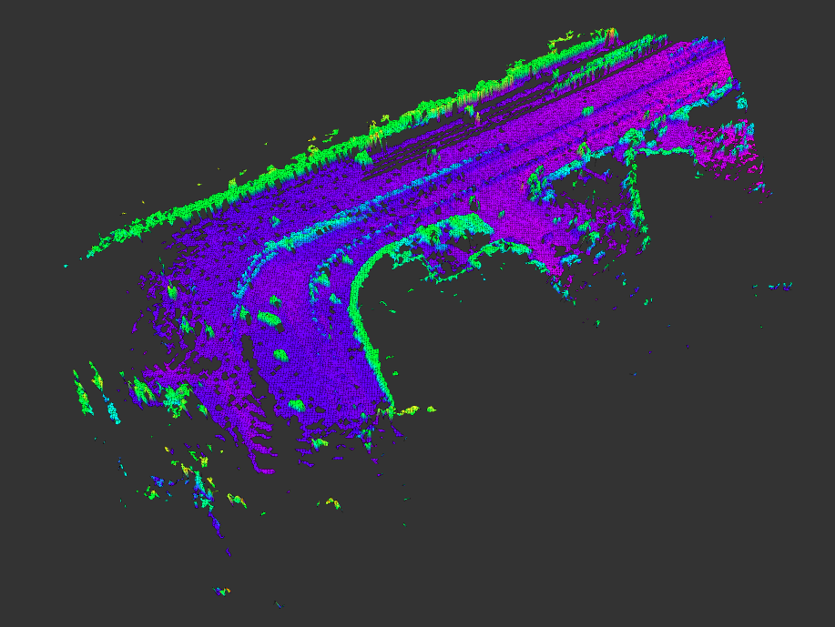
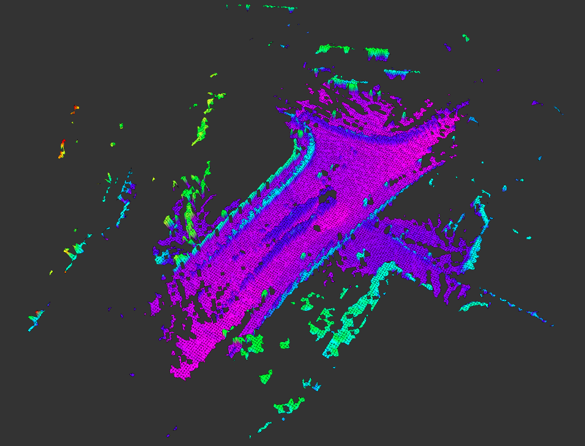
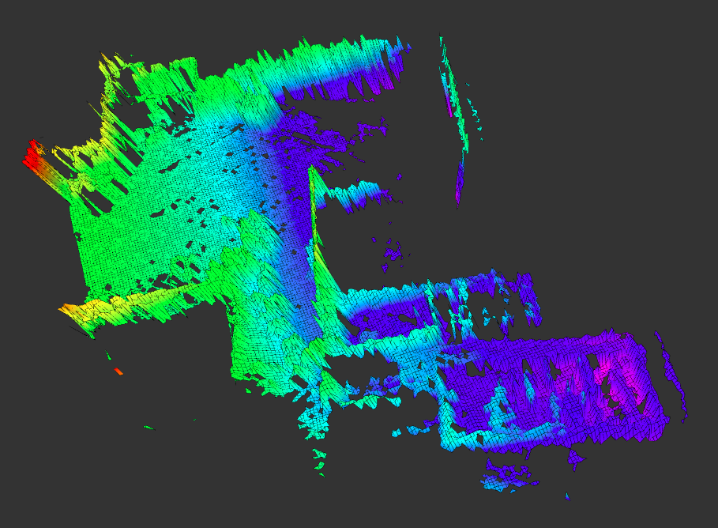
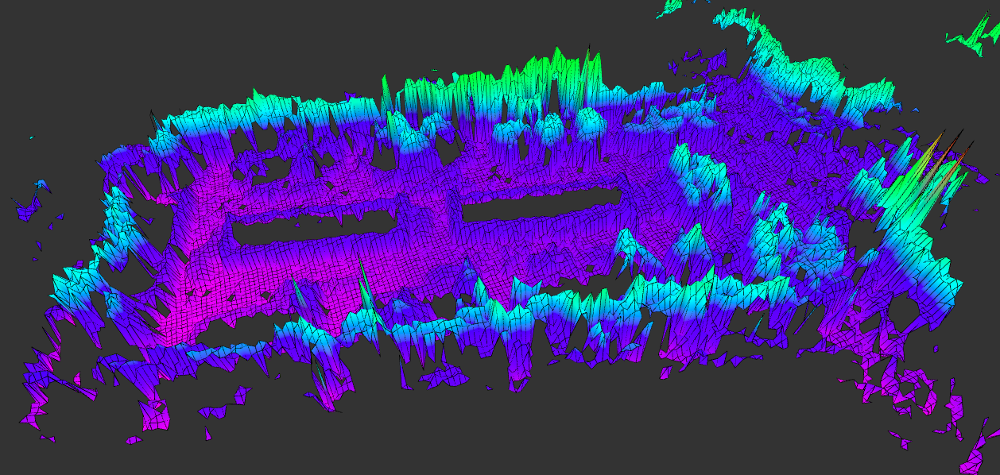

# 作品展示

------

## 1. 基于激光 SLAM 构建未知环境的地图模型

### 1.1 在 Kitti 数据集上运行的效果

​                                                                                                  场景1

​                                                                                                     场景2

​                                                                                                         场景3

### 1.2 在自己采集的点云数据上运行的效果

​                                                                                                 3D点云地图模型

​                                                                                                     高程地图模型

## 2. 基于 UWB 定位实现无人机在六自由度运动平台上的自主降落

## 3. 基于计算机视觉实现一些简单的 VR 和 AR 效果

### 3.1 VR demo  ——  虚拟广告牌

### 3.2 AR demo —— 3D 位姿估计

