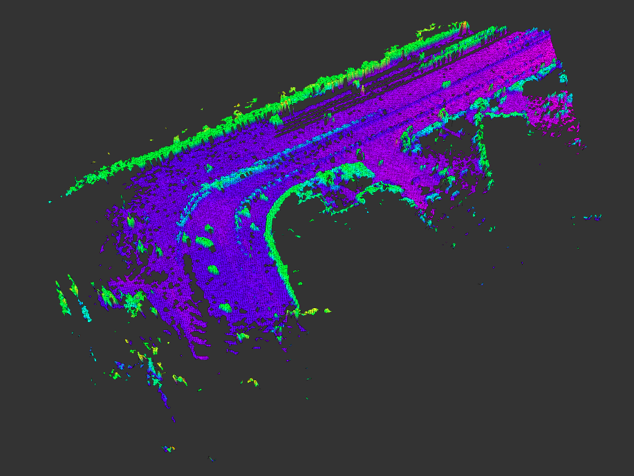
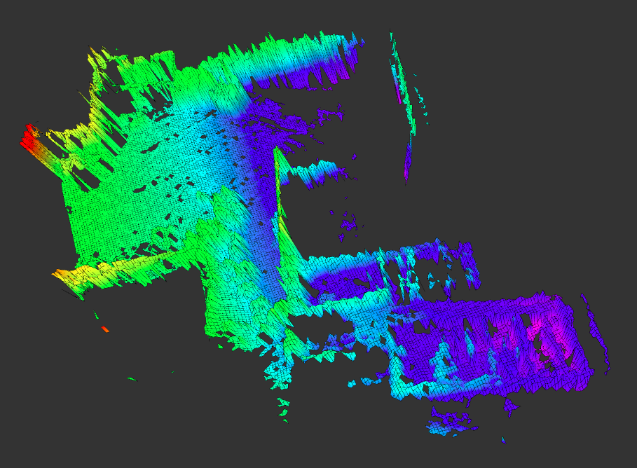
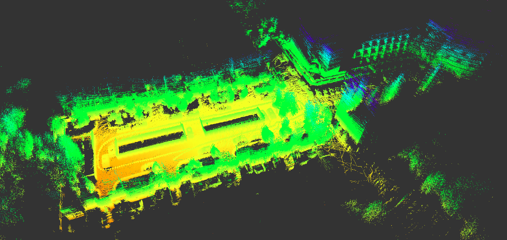
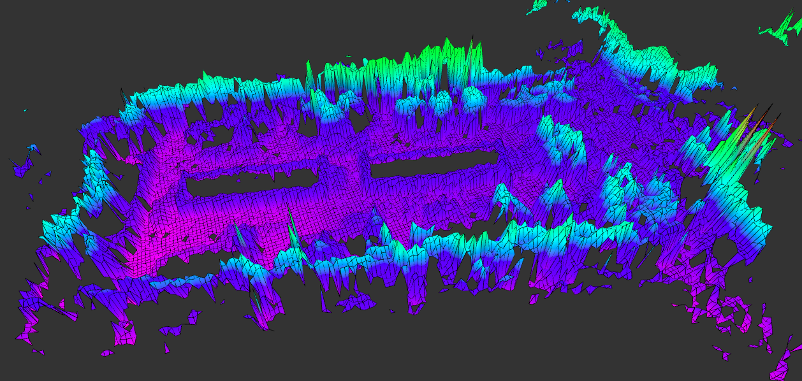

# 作品展示

------

## 1. 基于激光 SLAM 构建未知环境的地图模型

### 1.1 在 Kitti 数据集上运行的效果

场景1：街道转角

场景2：十字路口

场景3：大场景

​     

### 1.2 在自己采集的点云数据上运行的效果

3D点云地图模型

高程地图模型

 

## 2. 基于 UWB 定位实现无人机在六自由度运动平台上的自主降落

## 3. 基于计算机视觉实现一些简单的 VR 和 AR 效果

### 3.1 VR demo  ——  虚拟广告牌

一段踢足球的视频

给射门框加上虚拟广告牌之后

### 3.2 AR demo —— 3D 位姿估计

## 4. 基于 MAVROS 实现无人机编队控制，编写定制化的地面站程序

